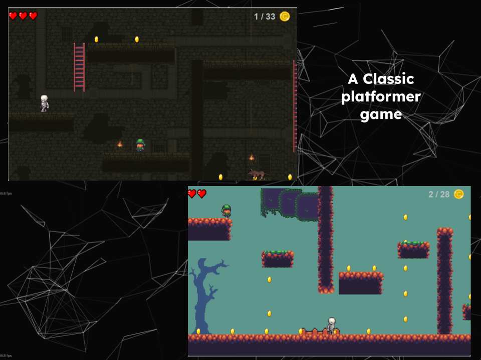

# A Keyboard controlled platformer Game
## Using Python 3 & Pygame

## How to start the game
> Install the files as ZIP (go to `Code` -> `Download as ZIP`) and extract all files
> 
> Go to folder src -> then run index.py

-------------

A scrollable platformer game with moving platforms and enemies.
Set in a fantasy medieval setting revolving around a character named 
Pento who sets out to save his King. Play as him as he escapes from 
a dungeon, dodges enemies and rescues the King!

Coded in python3 using Pygame

Hope you enjoy the game!

=> All attributions are on a file named Credits.txt
