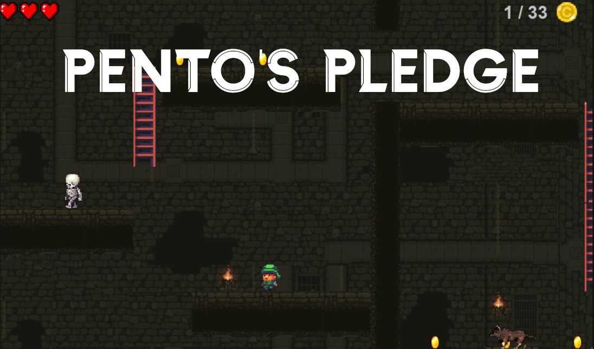
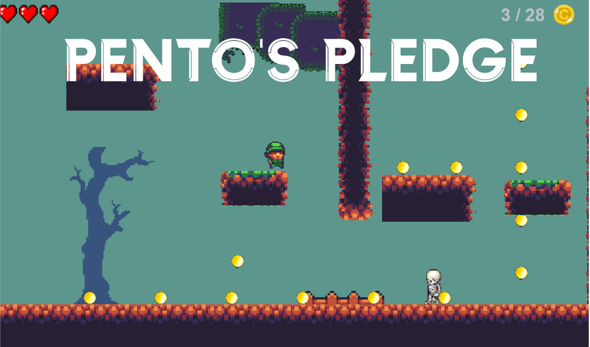

# A Keyboard controlled platformer Game

## Using Python 3 & Pygame
## How to start the game
> Install the files as ZIP (go to `Code` -> `Download as ZIP`) and extract all files
> 
> Go to folder src -> then run index.py

-------------

A scrollable platformer game with moving platforms and enemies.
Set in a fantasy medieval setting revolving around a character named 
Pento who sets out to save his King. Play as him as he escapes from 
a dungeon, dodges enemies and rescues the King!

Coded in python3 using Pygame

Hope you enjoy the game!

# Video demo: [https://youtu.be/8RKQsFKlfW8](https://youtu.be/8RKQsFKlfW8)

=> All attributions are on a file named Credits.txt

## Reflection: What did I learn/take away from this project?
At the time, this was probably one of the biggest projects I've ever undertaken. While I will be the first to admit that I may have bitten off more than I could chew by trying to add animations, and using custom made music + backgrounds, I am still extremly proud of what I made despite it's shortcomings! (Most notably in the number of levels in the game and spacial bugs in level 2) 

My take away really did come from the proccess of creating the game where I gained key insights into game design, animation and color throry. Additionally, I learned Object Oriented Programming to a great depth and how to read module documentation to add the features I wanted — skills that would become very pivotal to my future project, Nika | Confessions Discord bot. 

__
__

